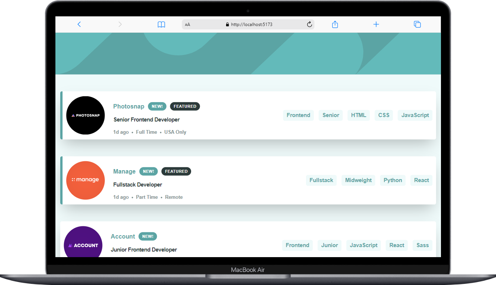
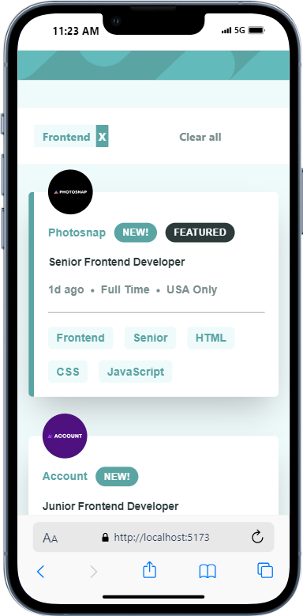

# Frontend Mentor - Job listings with filtering solution

This is a solution to the [Job listings with filtering challenge on Frontend Mentor](https://www.frontendmentor.io/challenges/job-listings-with-filtering-ivstIPCt).

## Table of contents

- [Overview](#overview)
  - [The challenge](#the-challenge)
  - [Screenshot](#screenshot)
  - [Links](#links)
- [My process](#my-process)
  - [Built with](#built-with)
  - [What I learned](#what-i-learned)
  - [Continued development](#continued-development)
- [Author](#author)

## Overview

### The challenge

Users should be able to:

- View the optimal layout for the site depending on their device's screen size
- See hover states for all interactive elements on the page
- Filter job listings based on the categories

### Screenshot

### Links

- Live Site URL: [live link](https://job-listing-umber.vercel.app/)

## My process

### Built with

- Semantic HTML5 markup
- CSS custom properties
- Flexbox
- CSS Grid
- TailwindCSS
- [React](https://reactjs.org/) - JS library

### What I learned

Ilearnt alot about filter using react. It was quite complicating but I later figured it out with the help of google. I still think there is more to learn on filter so I will still explore more on that.

### Continued development

Moving on, I will learn amd understand more on filtering using reactJs

## Author

- Frontend Mentor - [@abteck](https://www.frontendmentor.io/profile/abteck)
- Twitter - [@abteck2](https://www.twitter.com/abteck2)
